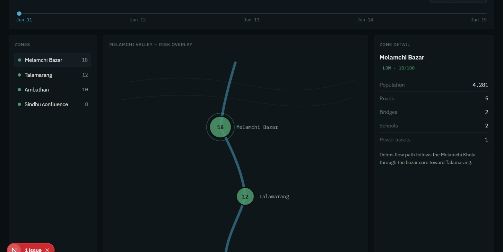
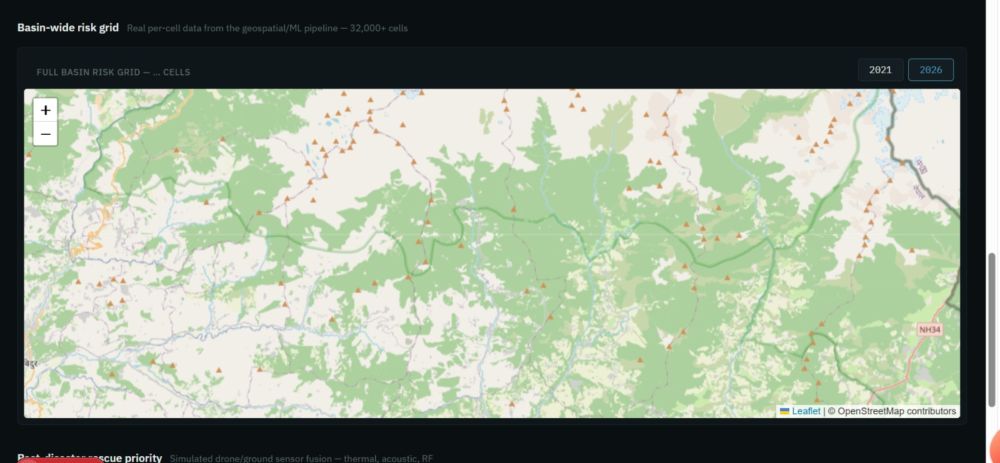
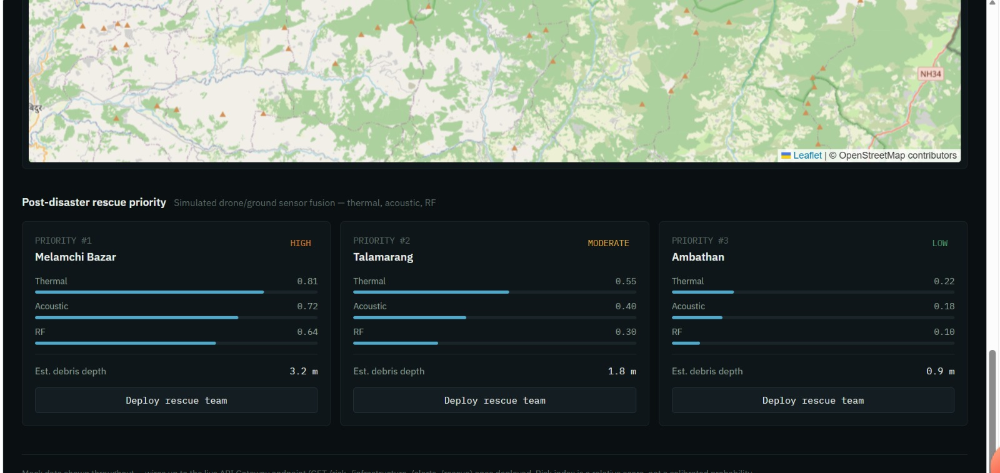

# 🌍 TerraSentinel-Nepal

<p align="center">
  <strong>AI-Powered Geospatial Disaster Intelligence & Decision Support for the Himalayas</strong>
</p>

<p align="center">
  Predict • Protect • Locate • Rescue
</p>

---

## 🚨 Overview

**TerraSentinel-Nepal** is a geospatial disaster-intelligence platform designed to help emergency-response and disaster-management teams understand environmental risk, identify areas requiring attention, and support faster decision-making in hazard-prone Himalayan regions.

The platform brings together:

- 🛰️ Satellite observations
- 🌧️ Rainfall and environmental data
- 🏔️ Terrain and hydrological features
- 🧊 Glacial-lake proximity information
- 🤖 AI/ML and geospatial processing
- ☁️ AWS cloud infrastructure
- 🗺️ Spatial risk visualization
- 🚑 Emergency-response and rescue workflows

The current implementation focuses on the **Melamchi watershed in Nepal** and demonstrates a V1 spatial risk engine alongside a web-based decision-support dashboard and cloud-oriented backend architecture.

---

# 🎯 The Problem

Himalayan communities face interconnected hazards such as:

- Extreme rainfall and flooding
- Landslides
- Debris flows
- Glacial-lake-related hazards
- Damage to roads, bridges, hydropower and other infrastructure
- Difficult terrain and limited emergency access

A major challenge during disaster management is that important information is distributed across different datasets and systems.

Rainfall may indicate a developing trigger.

Terrain may indicate susceptible locations.

Satellite imagery may reveal environmental change.

Infrastructure and geographic data may show what is exposed.

**The challenge is turning these separate signals into spatial information that people can actually use.**

TerraSentinel addresses this challenge by creating a unified geospatial decision-support workflow.

---

# 💡 Our Solution

TerraSentinel follows a simple operational concept:

```text
        PREDICT
           ↓
        PROTECT
           ↓
         LOCATE
           ↓
         RESCUE
```

### 🔮 Predict

Analyze rainfall, terrain and environmental conditions to identify areas with elevated spatial risk.

### 🛡️ Protect

Present risk information alongside geographic and infrastructure context to support preparedness and prioritization.

### 📍 Locate

Use post-event geospatial and satellite information to identify areas requiring assessment.

### 🚑 Rescue

Combine risk, damage and field information to support prioritization of emergency response and search activities.

---

# 🗺️ Current Demonstration: Melamchi, Nepal

The current geospatial risk implementation focuses on the **Melamchi watershed** and supports two event/scenario datasets:

- `MELAMCHI_2021`
- `MELAMCHI_2026`

### Spatial Framework

| Property | Value |
|---|---|
| Study area | Melamchi watershed, Nepal |
| Grid cells | **32,435 per event** |
| Grid resolution | **100 m × 100 m** |
| CRS | **EPSG:32645** |
| Risk scale | **0–100** |
| Output formats | CSV + GeoPackage |

The same spatial grid is used for both scenarios, enabling cell-by-cell comparison.

---

# 🤖 V1 Spatial Risk Engine

The current V1 engine produces a **0–100 spatial risk-prioritization score** for every grid cell.

> **Important:** This is a spatial prioritization index, not a calibrated probability that a landslide will occur.

The V1 baseline combines three interpretable components:

```text
                 🌧️ Rainfall
                     │
                     ▼
              Rainfall Score
                     │
                     │
🏔️ Terrain ──────────┼────────── 🧊 Lake Proximity
                     │
                     ▼
              ┌─────────────┐
              │ V1 RISK     │
              │ SCORE 0–100 │
              └─────────────┘
```

The baseline combines normalized component scores with equal weighting:

```text
Risk Score = 100 ×
             (Rainfall Score
             + Terrain Score
             + Lake Proximity Score) / 3
```

This approach was chosen to keep the V1 system **transparent, reproducible and interpretable**.

---

## 🌧️ Rainfall Intelligence

The rainfall pipeline examines multiple accumulation windows:

- `rainfall_1h`
- `rainfall_3h`
- `rainfall_24h`
- `rainfall_7day`

These capture both short-duration rainfall triggers and longer antecedent accumulation.

Correlation analysis was used during preprocessing to identify redundant rainfall variables.

The final spatial rainfall component is normalized to **0–1**.

### Resolution consideration

The underlying IMERG rainfall product has a coarser native spatial resolution than the 100 m analysis grid.

Therefore, the rainfall component should be interpreted as a **regional rainfall-trigger signal represented across the analysis grid**, rather than as independent 100 m rainfall measurements.

---

## 🏔️ Terrain Intelligence

Terrain susceptibility is represented using spatial features including:

- Slope
- Flow accumulation
- Distance to river
- Elevation
- Aspect
- Curvature
- River gradient

The V1 terrain component uses directional scoring so that:

- Higher slope → higher relative susceptibility
- Higher flow accumulation → higher relative runoff concentration
- Smaller distance to river → higher relative proximity

### Circular Aspect Handling

Aspect is a circular variable. The preprocessing pipeline therefore also represents it using:

```text
aspect_sin = sin(aspect)
aspect_cos = cos(aspect)
```

This prevents directions near 0° and 360° from being treated as far apart.

---

## 🧊 Glacial-Lake Intelligence

The V1 risk engine incorporates **distance to the nearest inventoried glacial lake**.

The normalized proximity component gives higher relative values to cells closer to an inventoried glacial lake.

Glacial-lake area and related information remain available as environmental context and for future model development.

---

# 🛰️ Satellite & Environmental Data

The broader TerraSentinel pipeline incorporates:

| Data source / feature | Purpose |
|---|---|
| **Sentinel-1 SAR** | Radar-based surface/change information |
| **Sentinel-2** | Optical environmental observations |
| **NDWI** | Water-related surface information |
| **NASA GPM IMERG** | Rainfall information |
| **DEM derivatives** | Terrain and elevation analysis |
| **Hydrological features** | River and flow-related context |
| **Glacial-lake data** | Lake proximity and hazard context |
| **Historical landslides** | Historical hazard reference |

Post-event satellite variables such as SAR/NDWI change are kept conceptually separate from the current V1 pre-event risk baseline so that the system does not make an unsupported claim about prediction.

---

# 📚 Historical Landslide Data & ML Strategy

Historical landslide information is incorporated as a reference and analytical layer.

During dataset exploration, the available historical labels were found to be too sparse and spatially limited to support a trustworthy supervised landslide classifier at the current 100 m resolution.

Instead of presenting an inadequately validated classifier as a production prediction model, V1 uses an **interpretable geospatial risk index**.

This provides a reproducible baseline while establishing a clear path toward supervised learning when a stronger event inventory becomes available.

### Future supervised-learning requirements

A future ML model should use:

- Better event-based landslide inventories
- Reliable positive and negative samples
- Spatially separated validation
- Temporal validation
- Probability calibration
- Independent evaluation
- Uncertainty estimation

---

# 📊 Risk Outputs

The current V1 pipeline generates four primary spatial outputs:

```text
data/data/processed/risk_v1/

├── melamchi_2021_risk_v1.csv
├── melamchi_2021_risk_v1.gpkg
├── melamchi_2026_risk_v1.csv
└── melamchi_2026_risk_v1.gpkg
```

### CSV Schema

| Field | Description |
|---|---|
| `cell_id` | Unique grid-cell identifier |
| `lat` | Cell latitude |
| `lon` | Cell longitude |
| `risk_score` | V1 risk-prioritization score, 0–100 |
| `rainfall_score` | Normalized rainfall component, 0–1 |
| `terrain_score` | Normalized terrain component, 0–1 |
| `lake_proximity_score` | Normalized lake-proximity component, 0–1 |

Each event contains **32,435 rows** with complete V1 risk scores.

GeoPackage outputs are provided for GIS and spatial-visualization workflows.

---

# 🖥️ Decision-Support Dashboard

The repository also contains a **Next.js / React / TypeScript** frontend designed as a disaster decision-support interface.

The dashboard includes concepts for:

- 🗺️ Risk-zone visualization
- 📊 Risk-level classification
- 📈 Risk trends
- 🏗️ Infrastructure information
- 🚨 Alerts
- 🚑 Rescue information
- 🧪 Event simulation
- 📍 Per-cell risk-grid visualization

The frontend API layer supports integration with backend endpoints such as:

```text
GET  /risk
GET  /risk/{zone}
GET  /infrastructure
GET  /alerts
POST /simulate-event
GET  /risk-map/{year}
```

The frontend can also use local/static risk-grid data during development before the cloud API is connected.

---


## 🖥️ Dashboard Preview

### 🌍 Command-Center Risk Dashboard

The TerraSentinel dashboard provides a centralized view of basin-level risk, affected zones, population exposure, and critical infrastructure.

<p align="center">
  
</p>

---

### 🗺️ Basin-Wide Risk Grid

The basin-wide risk grid provides spatial visualization across more than **32,000 grid cells**, allowing users to inspect the geographic distribution of risk across the Melamchi watershed.

<p align="center">
  
</p>

The interface supports scenario comparison between **2021** and **2026**.

---

### 🚑 Post-Disaster Rescue Priority

The rescue module converts post-event sensing information into prioritized response cases.

<p align="center">
  
</p>

The rescue interface displays:

- 🔥 Thermal signal
- 🔊 Acoustic signal
- 📡 RF signal
- 🌊 Estimated debris depth
- 🚨 Rescue priority
- 📍 Target location
- 🚑 Rescue-team deployment

# ☁️ AWS Architecture

TerraSentinel is designed around an event-driven, serverless AWS architecture.

```text
             Environmental / Geospatial Data
                         │
                         ▼
                    Amazon S3
                         │
                         ▼
              AWS Step Functions
                         │
        ┌────────────────┼────────────────┐
        ▼                ▼                ▼
   AWS Lambda       AWS Lambda       AWS Lambda
  Data Processing   Feature Engine    Risk / ML
        │                │                │
        └────────────────┼────────────────┘
                         ▼
                  Amazon SageMaker
                         │
                         ▼
                    Risk Results
                         │
                         ▼
                   Amazon DynamoDB
                         │
                         ▼
                  Amazon API Gateway
                         │
                         ▼
                 Next.js / React UI
                         │
                         ▼
                 Decision Support
```

### AWS Services

| AWS Service | Role |
|---|---|
| **Amazon S3** | Geospatial and environmental data storage |
| **AWS Lambda** | Serverless processing and API functions |
| **AWS Step Functions** | Workflow orchestration |
| **Amazon SageMaker** | ML inference/deployment layer |
| **Amazon DynamoDB** | Risk, infrastructure and alert data |
| **Amazon API Gateway** | Backend API access |
| **Amazon Polly** | Voice-based alert capability |

The backend also provides local simulation and development workflows so the application can be demonstrated independently of a full production deployment.

---

# 🧰 Technology Stack

### AI / ML

- Python
- Pandas
- NumPy
- Scikit-learn
- XGBoost
- Jupyter

### Geospatial

- GeoPandas
- Rasterio
- Shapely
- PyProj

### Remote Sensing

- Sentinel-1
- Sentinel-2
- NDWI
- NASA GPM IMERG

### Cloud

- Amazon S3
- AWS Lambda
- AWS Step Functions
- Amazon SageMaker
- Amazon DynamoDB
- Amazon API Gateway
- Amazon Polly

### Application

- Next.js
- React
- TypeScript
- Git
- GitHub

---

# 🏗️ Repository Structure

```text
TerraSentinel-Nepal/
│
├── data/
│   ├── raw/
│   │   ├── geometry/
│   │   └── hazards/
│   └── processed/
│       └── risk_v1/
│
├── ml/
│   ├── notebooks/
│   └── preprocessing/
│
├── backend/
│   ├── functions/
│   ├── scripts/
│   ├── statemachine/
│   └── tests/
│
├── frontend/
│   ├── app/
│   ├── components/
│   └── lib/
│
└── docs/
```

---

# 🔬 Reproducible ML / Geospatial Workflow

The current workflow follows:

```text
Raw Data
   │
   ▼
Dataset Inspection
   │
   ▼
Missing-Data & Quality Checks
   │
   ▼
Feature Analysis
   │
   ├── Correlation
   ├── Skewness
   └── Distribution Checks
   │
   ▼
Feature Transformation
   │
   ▼
Normalization / Scoring
   │
   ▼
Rainfall + Terrain + Lake Components
   │
   ▼
V1 Risk Score
   │
   ▼
CSV / GeoPackage
   │
   ▼
Backend / Dashboard
```

The resulting outputs can be inspected independently of the application layer.

---

# ⚠️ Current Limitations

TerraSentinel V1 is intentionally presented with clear limitations.

### Risk score ≠ probability

A score of `70` does **not** mean a 70% probability of a landslide.

### Sparse historical labels

The available historical landslide inventory is not yet sufficient for a defensible supervised model at 100 m resolution.

### Rainfall spatial resolution

IMERG rainfall has a coarser native resolution than the analysis grid.

### V1 component model

The current score is an interpretable baseline rather than a calibrated end-to-end predictive ML model.

### Cloud integration

The repository contains the cloud-oriented backend architecture and integration interfaces, while the final production deployment can continue to evolve.

---

# 🚀 Roadmap

## V2 — Data-Driven ML Risk Prediction

- Build a stronger event inventory
- Generate reliable training labels
- Train supervised models
- Perform spatial and temporal validation
- Calibrate predicted probabilities
- Quantify model uncertainty

## Real-Time Risk Intelligence

- Automated rainfall ingestion
- Near-real-time satellite processing
- Event-driven risk updates
- Automated cloud inference
- Real-time alert generation

## Post-Disaster Intelligence

- SAR change detection
- Optical change detection
- Drone imagery
- Ground observations
- Infrastructure damage assessment
- Search-area prioritization

## Himalayan Expansion

Extend the framework to additional Himalayan watersheds when suitable regional data becomes available.

---

# 👥 Team

| Team Member | Contribution |
|---|---|
| **Mathew** | Team Lead — Frontend & Decision Support |
| **Zahwa** | AI/ML & Geospatial Risk Intelligence |
| **Manas** | AWS & Backend |
| **Devana** | Satellite & Environmental Data |

---

# 🏆 Hackathon Demonstration

The current demonstration brings together three major layers:

### 1. 🧠 Intelligence

A reproducible geospatial V1 risk engine operating across **32,435 grid cells** for the Melamchi study area.

### 2. ☁️ Infrastructure

A cloud-oriented AWS backend architecture for processing, storing and serving risk and emergency information.

### 3. 🖥️ Experience

A command-center-style web interface designed to turn complex spatial information into information that emergency teams can understand and act upon.

---

# 🌍 Impact

TerraSentinel aims to shorten the path from **raw environmental data to an actionable emergency decision**.

```text
Data
  ↓
Geospatial Intelligence
  ↓
Risk Prioritization
  ↓
Visualization
  ↓
Cloud/API Delivery
  ↓
Human Decision Support
  ↓
Emergency Preparedness & Response
```

The platform is designed to help disaster-management teams answer practical questions such as:

- **Where is risk concentrated?**
- **Which areas should receive attention first?**
- **What environmental signals are contributing to the risk?**
- **Which infrastructure or communities may require assessment?**
- **Where should post-event investigation and rescue resources be prioritized?**

---

# 🔭 Vision

> **Turn fragmented geospatial data into actionable disaster intelligence for safer Himalayan communities.**

## Predict → Protect → Locate → Rescue 🚨
